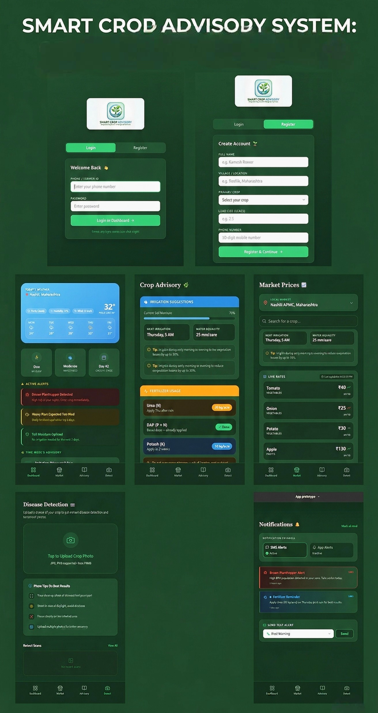

# Smart Crop Advisory System 🌱

## 📌 Description
This is a prototype of a Smart Crop Advisory System designed using Figma.

> **Objective:** Build an AI-powered advisory platform that gives farmers localized, timely, and affordable crop recommendations.

### ✨ Features
* Weather updates
* Crop advisory
* Market prices
* Alerts system

## 🚀 How to View the Prototype
Click the link below to open and interact with the High-Fidelity design:

[🔗 Open Figma Prototype](https://www.figma.com/make/Lmexmdzie0hmso3iC9r0ia/App-prototype?fullscreen=1&t=YSAmLu1YwbcWvPDs-1)

### 📸 App Preview

---

## 🧪 Testing & Experiment
**Goal:** Observe if a user can easily find the market prices feature without help.

* **Result:** The user successfully found the feature in under 10 seconds.
* **Feedback:** The user felt the text size was good, but suggested making the "Alerts" button slightly larger for easier tapping on mobile.
